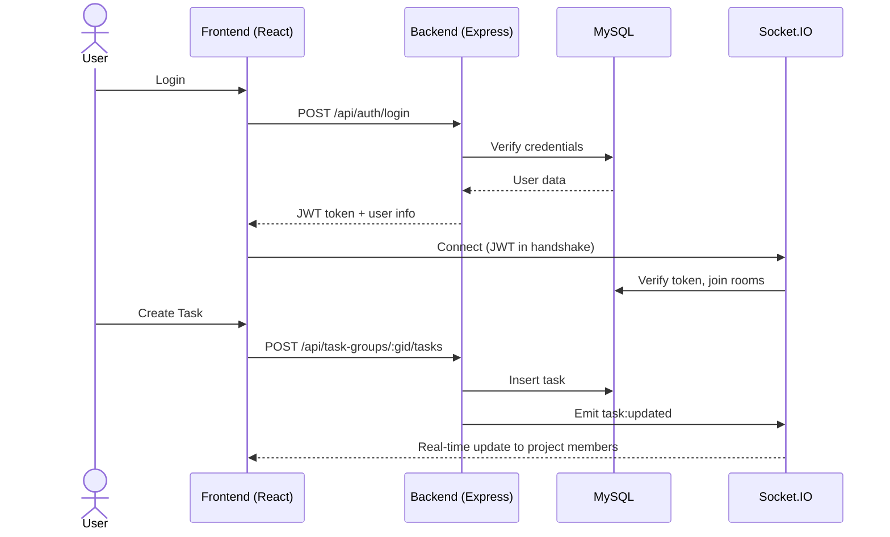

# 🏗️ Kiến Trúc Tổng Thể — Project Manager System

## 1. Kiến Trúc Hệ Thống (System Architecture)

```
┌─────────────────────┐       REST API / WebSocket       ┌──────────────────────┐
│    FRONTEND (SPA)   │  ◄──────────────────────────────► │   BACKEND (API)      │
│  React 19 + Vite    │       HTTP :5000 / WS :5000      │  Express 5 + TS      │
│  TailwindCSS        │                                   │  Socket.IO           │
│  Port: 5173         │                                   │  Port: 5000          │
└─────────────────────┘                                   └──────────┬───────────┘
                                                                     │
                                                          ┌──────────▼───────────┐
                                                          │    MySQL Database     │
                                                          │  via Prisma ORM      │
                                                          │  Port: 3306          │
                                                          └──────────────────────┘
```

---

## 2. Backend Architecture

Backend sử dụng kiến trúc **Layered Architecture** kết hợp yếu tố **Domain-Driven Design (DDD)**:

```
┌───────────────────────────────────────────────────┐
│                    Routes Layer                    │   ← Định tuyến HTTP endpoints
├───────────────────────────────────────────────────┤
│                 Controllers Layer                  │   ← Parse request, gọi service, trả response
├───────────────────────────────────────────────────┤
│               Validators Layer (Zod)               │   ← Validate request body/query/params
├───────────────────────────────────────────────────┤
│                  Services Layer                    │   ← Business logic chính
├───────────────────────────────────────────────────┤
│              Domain Layer (Entities)               │   ← Domain objects + value objects
├───────────────────────────────────────────────────┤
│         Infrastructure (Prisma Repositories)       │   ← Data access layer
├───────────────────────────────────────────────────┤
│                Socket.IO Layer                     │   ← Real-time events
└───────────────────────────────────────────────────┘
```

### 2.1. Chi tiết từng layer

| Layer | Thư mục | Mô tả |
|-------|---------|--------|
| **Routes** | `src/routes/` | Khai báo HTTP method + path, gắn middleware (auth, validate, authorize) |
| **Controllers** | `src/controllers/` | Nhận req/res, trích xuất params, gọi service, trả JSON |
| **Validators** | `src/validators/` | Zod schemas cho body, query, params — chạy qua `validateMiddleware` |
| **Services** | `src/services/` | Chứa toàn bộ nghiệp vụ: CRUD + business rules + phát notification/socket events |
| **Domain** | `src/domain/` | Entities (Project, Task, User) + Value Objects (Password) + Repository interfaces |
| **Infrastructure** | `src/infrastructure/` | Implement repository pattern bằng Prisma |
| **Middlewares** | `src/middlewares/` | Auth (JWT verify), Authorize (role check), Error handling, Upload (Multer), Validate |
| **Socket** | `src/socket/` | Real-time: chat, typing indicator, notifications, task updates, user online status |
| **Utils** | `src/utils/` | AppError custom class, asyncHandler, generateToken, parseRequestId |

### 2.2. Luồng xử lý request

```
Client Request
    │
    ▼
[CORS Middleware]
    │
    ▼
[Route Matching] ─── app.use('/api/auth', authRoutes)
    │
    ▼
[protect Middleware] ─── JWT verify → req.user
    │
    ▼
[authorizeRoles Middleware] ─── Kiểm tra role (nếu cần)
    │
    ▼
[validate Middleware] ─── Zod schema parse
    │
    ▼
[Controller] ─── Gọi Service
    │
    ▼
[Service] ─── Business logic + Prisma queries + Socket emit
    │
    ▼
[JSON Response] ─── { success, message, data }
    │
    ▼
[errorHandler] ─── Bắt lỗi toàn cục (AppError / 500)
```

### 2.3. Socket.IO Architecture

```
Client (socket.io-client)
    │
    ▼
[Connection] ── JWT auth via handshake
    │
    ├── Auto-join rooms: user:{id}, project:{id}, chat:{id}
    │
    ├── Events IN:
    │   ├── chat:send     → Lưu DB + broadcast to chat room
    │   ├── chat:typing   → Broadcast typing indicator
    │   ├── chat:read     → Mark messages as read + broadcast
    │   ├── comment:new   → Broadcast to project room
    │   └── task:updated  → Broadcast to project room
    │
    └── Events OUT:
        ├── chat:send         → Tin nhắn mới
        ├── chat:typing       → Đang gõ
        ├── chat:read         → Đã đọc
        ├── notification:new  → Thông báo mới
        ├── user:online       → User lên mạng
        ├── user:offline      → User offline
        ├── comment:new       → Comment mới
        └── task:updated      → Task cập nhật
```

---

## 3. Frontend Architecture

### 3.1. Tổng quan

Frontend là **Single Page Application (SPA)** sử dụng React 19 + Vite, routing bằng `react-router-dom v7`.

```
┌────────────────────────────────────────────────┐
│                   App.jsx                       │
│  (BrowserRouter + AuthProvider + SocketProvider)│
├────────────────────────────────────────────────┤
│              DashboardLayout                    │  ← Sidebar + Header + Content area
├────────────────────────────────────────────────┤
│                  Pages (13)                     │  ← Mỗi page = 1 route
├────────────────────────────────────────────────┤
│            Components (by feature)              │  ← task/, project/, chat/, document/, chart/
├────────────────────────────────────────────────┤
│              API Layer (Axios)                  │  ← 12 API modules
├────────────────────────────────────────────────┤
│          State: Jotai + React Context           │  ← Auth, Socket, UI atoms
├────────────────────────────────────────────────┤
│           UI: Shadcn/Radix + TailwindCSS        │  ← Design system
└────────────────────────────────────────────────┘
```

### 3.2. Routing & Access Control

| Path | Page | Quyền truy cập |
|------|------|-----------------|
| `/login` | LoginPage | Public only |
| `/forgot-password` | ForgotPasswordPage | Public only |
| `/reset-password/:token` | ResetPasswordPage | Public only |
| `/accept-invite` | AcceptInvitePage | Public (luôn truy cập được) |
| `/dashboard` | DashboardPage | Protected (all roles) |
| `/projects` | ProjectsPage | Protected (all roles) |
| `/projects/:id` | ProjectDetailPage | Protected (all roles) |
| `/tasks` | MyTasksPage | Protected (Admin, Director, Employee) |
| `/chat` | ChatPage | Protected (all roles) |
| `/chat/:groupId` | ChatPage | Protected (all roles) |
| `/members` | MembersPage | Protected (**Admin only**) |
| `/profile` | ProfilePage | Protected (all roles) |
| `/settings` | SettingsPage | Protected (**Admin only**) |

### 3.3. State Management

- **AuthContext**: Quản lý user session (login, loginGoogle, logout, loading state)
- **SocketContext**: Quản lý kết nối Socket.IO (auto-connect khi có user)
- **Jotai atoms**: Quản lý UI state cục bộ (filters, selections, toggles)
- **Component-level state**: useState / useReducer cho state riêng

### 3.4. API Layer

12 module API trong `src/api/`, mỗi module wrap `axiosClient` (base URL: `http://localhost:5000/api`):

- **axiosClient.js** — Axios instance + JWT interceptor (auto-attach token, auto-logout on 401)
- **authApi** / **userApi** / **projectApi** / **taskApi** / **taskGroupApi** / **commentApi** / **chatApi** / **documentApi** / **notificationApi** / **reportApi** / **companyApi**

---

## 4. Sơ đồ tương tác chính



---

## 5. Design Patterns Sử Dụng

| Pattern | Áp dụng |
|---------|---------|
| **Repository Pattern** | `infrastructure/repositories/` — trừu tượng hóa data access |
| **Service Layer** | `services/` — tập trung business logic |
| **Middleware Chain** | Express middleware pipeline: auth → authorize → validate → controller |
| **Observer (Pub/Sub)** | Socket.IO rooms + events |
| **Singleton** | Prisma client (`lib/prisma.ts`), Socket.IO instance |
| **Value Object** | `domain/value-objects/Password.ts` — đóng gói logic hash/verify |
| **DTO / Schema Validation** | Zod schemas trong `validators/` |
| **Context Provider** | React Context cho Auth + Socket |
