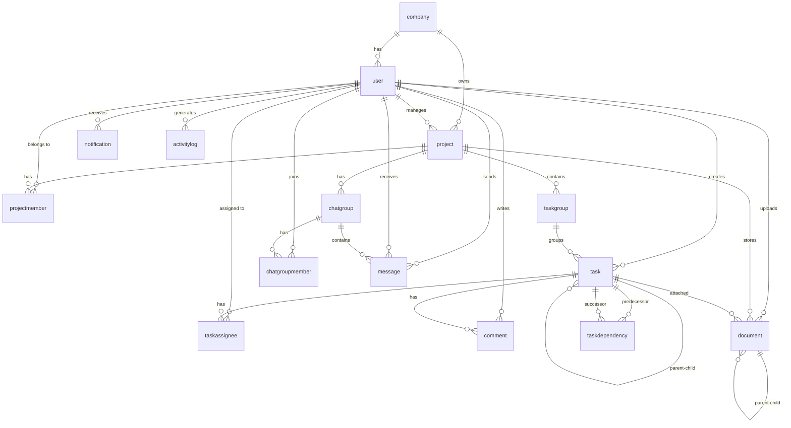

# 🗄️ Thiết Kế Cơ Sở Dữ Liệu — Project Manager System

## 1. Tổng Quan

- **DBMS**: MySQL 8
- **ORM**: Prisma (schema-first)
- **Schema file**: `backend/prisma/schema.prisma`
- **Tổng số bảng**: 14
- **Tổng số enum**: 9

---

## 2. Entity Relationship Diagram (ERD)

---

## 3. Chi Tiết Từng Bảng

### 3.1. `user` — Người dùng

| Cột | Kiểu | Ràng buộc | Mô tả |
|-----|------|-----------|-------|
| `id` | INT | PK, Auto | ID |
| `company_id` | INT | FK → company | Công ty |
| `full_name` | VARCHAR(255) | Nullable | Họ tên |
| `email` | VARCHAR(255) | UNIQUE | Email đăng nhập |
| `password` | VARCHAR(255) | Nullable | Mật khẩu (bcrypt hash) |
| `resetPasswordToken` | VARCHAR | Nullable | Token reset mật khẩu |
| `resetPasswordExpires` | DATETIME | Nullable | Hạn token reset |
| `inviteToken` | VARCHAR | UNIQUE | Token lời mời |
| `inviteExpires` | DATETIME | Nullable | Hạn lời mời |
| `google_id` | VARCHAR(255) | UNIQUE | Google OAuth ID |
| `role` | ENUM | Default: Employee | Admin / Director / Employee |
| `status` | ENUM | Default: Active | Active / Inactive / Pending |
| `authProvider` | VARCHAR(50) | Default: "local" | "local" / "google" |
| `is_online` | BOOLEAN | Default: false | Trạng thái online (Socket.IO) |
| `avatar_path` | VARCHAR(255) | Nullable | Đường dẫn avatar |
| `created_at` | TIMESTAMP | Default: now() | Ngày tạo |
| `updated_at` | TIMESTAMP | Auto update | Ngày cập nhật |

---

### 3.2. `company` — Công ty

| Cột | Kiểu | Ràng buộc | Mô tả |
|-----|------|-----------|-------|
| `id` | INT | PK, Auto | ID |
| `company_name` | VARCHAR(255) | NOT NULL | Tên công ty |
| `logo_path` | VARCHAR(255) | Nullable | Logo |
| `field` | VARCHAR(100) | Nullable | Lĩnh vực |
| `scale` | VARCHAR(50) | Nullable | Quy mô |
| `created_at` | TIMESTAMP | Default: now() | Ngày tạo |
| `updated_at` | TIMESTAMP | Auto update | Ngày cập nhật |

---

### 3.3. `project` — Dự án

| Cột | Kiểu | Ràng buộc | Mô tả |
|-----|------|-----------|-------|
| `id` | INT | PK, Auto | ID |
| `company_id` | INT | FK → company | Công ty sở hữu |
| `manager_id` | INT | FK → user | Quản lý dự án |
| `project_name` | VARCHAR(255) | NOT NULL | Tên dự án |
| `description` | TEXT | Nullable | Mô tả |
| `start_date` | DATE | Nullable | Ngày bắt đầu |
| `end_date` | DATE | Nullable | Ngày kết thúc |
| `color_code` | VARCHAR(7) | Default: #000000 | Mã màu hiển thị |
| `label` | VARCHAR(100) | Nullable | Nhãn |
| `priority` | ENUM | Default: Medium | Low / Medium / High / Urgent |
| `status` | ENUM | Default: Active | Active / Completed / Archived |
| `created_at` | TIMESTAMP | Default: now() | Ngày tạo |

---

### 3.4. `projectmember` — Thành viên dự án

| Cột | Kiểu | Ràng buộc | Mô tả |
|-----|------|-----------|-------|
| `project_id` | INT | PK, FK → project | Dự án |
| `user_id` | INT | PK, FK → user | Người dùng |
| `joined_at` | TIMESTAMP | Default: now() | Ngày tham gia |
| `role` | ENUM | Default: Member | Manager / Member / Viewer |

> **Composite PK**: (project_id, user_id)

---

### 3.5. `taskgroup` — Nhóm công việc

| Cột | Kiểu | Ràng buộc | Mô tả |
|-----|------|-----------|-------|
| `id` | INT | PK, Auto | ID |
| `project_id` | INT | FK → project | Dự án |
| `group_name` | VARCHAR(255) | NOT NULL | Tên nhóm (VD: "To Do", "In Progress") |
| `position` | INT | Default: 0 | Thứ tự sắp xếp |

---

### 3.6. `task` — Công việc

| Cột | Kiểu | Ràng buộc | Mô tả |
|-----|------|-----------|-------|
| `id` | INT | PK, Auto | ID |
| `parent_task_id` | INT | FK → task (self) | Công việc cha (subtask) |
| `task_group_id` | INT | FK → taskgroup | Nhóm công việc |
| `creator_id` | INT | FK → user | Người tạo |
| `title` | VARCHAR(255) | NOT NULL | Tiêu đề |
| `label` | VARCHAR(100) | Nullable | Nhãn |
| `description` | TEXT | Nullable | Mô tả chi tiết |
| `deadline` | DATETIME | Nullable | Hạn chót |
| `priority` | ENUM | Default: Medium | Low / Medium / High / Urgent |
| `status` | ENUM | Default: Todo | Todo / InProgress / Review / Completed / Overdue |
| `completion_percent` | INT | Default: 0 | Phần trăm hoàn thành (0-100) |
| `position` | INT | Default: 0 | Thứ tự trong nhóm |
| `is_archived` | BOOLEAN | Default: false | Đã lưu trữ |
| `created_at` | TIMESTAMP | Default: now() | Ngày tạo |
| `updated_at` | TIMESTAMP | Default: now() | Ngày cập nhật |

---

### 3.7. `taskassignee` — Phân công

| Cột | Kiểu | Ràng buộc | Mô tả |
|-----|------|-----------|-------|
| `task_id` | INT | PK, FK → task | Công việc |
| `user_id` | INT | PK, FK → user | Người được giao |
| `role` | ENUM | Default: Main | Main / Support |

---

### 3.8. `taskdependency` — Phụ thuộc

| Cột | Kiểu | Ràng buộc | Mô tả |
|-----|------|-----------|-------|
| `predecessor_id` | INT | PK, FK → task | Task tiên quyết |
| `successor_id` | INT | PK, FK → task | Task phụ thuộc |

---

### 3.9. `comment` — Bình luận

| Cột | Kiểu | Ràng buộc | Mô tả |
|-----|------|-----------|-------|
| `id` | INT | PK, Auto | ID |
| `task_id` | INT | FK → task | Công việc (cascade delete) |
| `user_id` | INT | FK → user | Người bình luận |
| `content` | TEXT | Nullable | Nội dung |
| `created_at` | TIMESTAMP | Default: now() | Ngày tạo |

---

### 3.10. `document` — Tài liệu

| Cột | Kiểu | Ràng buộc | Mô tả |
|-----|------|-----------|-------|
| `id` | INT | PK, Auto | ID |
| `project_id` | INT | FK → project | Dự án |
| `task_id` | INT | FK → task | Task đính kèm (nullable) |
| `parent_folder_id` | INT | FK → document (self) | Thư mục cha |
| `uploader_id` | INT | FK → user | Người upload |
| `file_name` | VARCHAR(255) | NOT NULL | Tên file |
| `file_path` | VARCHAR(255) | NOT NULL | Đường dẫn lưu trữ |
| `type` | ENUM | NOT NULL | Folder / File |
| `size_kb` | INT | Default: 0 | Kích thước (KB) |
| `mime_type` | VARCHAR(100) | Nullable | MIME type |
| `created_at` | TIMESTAMP | Default: now() | Ngày tạo |

---

### 3.11. `chatgroup` — Nhóm chat

| Cột | Kiểu | Ràng buộc | Mô tả |
|-----|------|-----------|-------|
| `id` | INT | PK, Auto | ID |
| `project_id` | INT | FK → project | Dự án liên kết |
| `group_name` | VARCHAR(255) | Nullable | Tên nhóm |
| `group_image` | VARCHAR(255) | Nullable | Ảnh nhóm |
| `created_at` | TIMESTAMP | Default: now() | Ngày tạo |

---

### 3.12. `chatgroupmember` — Thành viên nhóm chat

| Cột | Kiểu | Ràng buộc | Mô tả |
|-----|------|-----------|-------|
| `chat_group_id` | INT | PK, FK → chatgroup | Nhóm chat |
| `user_id` | INT | PK, FK → user | Người dùng |
| `joined_at` | TIMESTAMP | Default: now() | Ngày tham gia |

---

### 3.13. `message` — Tin nhắn

| Cột | Kiểu | Ràng buộc | Mô tả |
|-----|------|-----------|-------|
| `id` | INT | PK, Auto | ID |
| `sender_id` | INT | FK → user | Người gửi |
| `chat_group_id` | INT | FK → chatgroup | Nhóm chat |
| `receiver_id` | INT | FK → user | Người nhận (chat riêng) |
| `content` | TEXT | Nullable | Nội dung |
| `type` | ENUM | Default: Text | Text / Image / File |
| `file_path` | VARCHAR(255) | Nullable | Đường dẫn file |
| `is_read` | BOOLEAN | Default: false | Đã đọc |
| `sent_at` | TIMESTAMP | Default: now() | Thời gian gửi |

---

### 3.14. `notification` — Thông báo

| Cột | Kiểu | Ràng buộc | Mô tả |
|-----|------|-----------|-------|
| `id` | INT | PK, Auto | ID |
| `user_id` | INT | FK → user | Người nhận |
| `content` | TEXT | Nullable | Nội dung |
| `link_url` | VARCHAR(255) | Nullable | URL liên kết |
| `is_read` | BOOLEAN | Default: false | Đã đọc |
| `created_at` | TIMESTAMP | Default: now() | Ngày tạo |

---

### 3.15. `activitylog` — Nhật ký hoạt động

| Cột | Kiểu | Ràng buộc | Mô tả |
|-----|------|-----------|-------|
| `id` | INT | PK, Auto | ID |
| `user_id` | INT | FK → user | Người thực hiện |
| `action` | VARCHAR(255) | Nullable | Hành động |
| `details` | TEXT | Nullable | Chi tiết |
| `target_table` | VARCHAR(50) | Nullable | Bảng liên quan |
| `target_id` | INT | Nullable | ID đối tượng |
| `created_at` | TIMESTAMP | Default: now() | Ngày tạo |

---

## 4. Enums

| Enum | Giá trị |
|------|---------|
| `user_role` | Admin, Director, Employee |
| `user_status` | Active, Inactive, Pending |
| `project_priority` | Low, Medium, High, Urgent |
| `project_status` | Active, Completed, Archived |
| `task_priority` | Low, Medium, High, Urgent |
| `task_status` | Todo, InProgress, Review, Completed, Overdue |
| `taskassignee_role` | Main, Support |
| `projectmember_role` | Manager, Member, Viewer |
| `message_type` | Text, Image, File |
| `document_type` | Folder, File |

---

## 5. Indexes

| Bảng | Index | Mục đích |
|------|-------|----------|
| `user` | `idx_user_email` | Tìm kiếm nhanh theo email |
| `task` | `idx_task_group` | Lọc task theo nhóm |
| `notification` | `idx_notif_user` (user_id, is_read) | Đếm thông báo chưa đọc nhanh |
| `message` | `idx_msg_group` | Lấy tin nhắn theo nhóm chat |
| `projectmember` | `idx_pm_project` | Lấy thành viên theo dự án |
| `document` | `idx_doc_task` | Lấy tài liệu theo task |

---

## 6. Quan Hệ Đặc Biệt

### Self-referencing
- **task ↔ task**: Subtask (parent_task_id → task.id) — hỗ trợ phân cấp công việc
- **document ↔ document**: Folder tree (parent_folder_id → document.id)

### Cascade Delete
- `projectmember` — xóa khi xóa project hoặc user
- `chatgroupmember` — xóa khi xóa chatgroup hoặc user
- `taskassignee` — xóa khi xóa task hoặc user
- `taskdependency` — xóa khi xóa task
- `comment` — xóa khi xóa task
- `document` — xóa khi xóa project hoặc parent folder
- `taskgroup` — xóa khi xóa project
- `task` — xóa khi xóa taskgroup hoặc parent task
